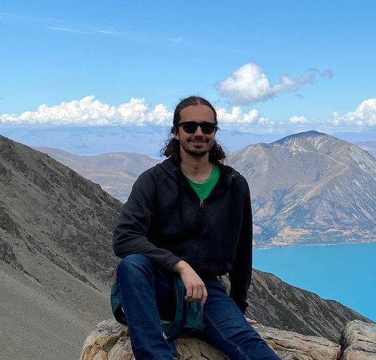

## [Home](README)&nbsp; &nbsp; &nbsp;[Research]()&nbsp; &nbsp; &nbsp;[CV](PDFs/Mark Stukel CV.pdf)&nbsp; &nbsp; &nbsp;[Contact](contact-info)
## Mark Stukel, PhD

### About Me
I am a Postdoctoral Scholar in the [Bond Lab](https://www.bondlab.org/) in the UC Davis Entomology & Nematology department and the [Forthman Lab](https://mforthman.weebly.com/) at the California Department of Food and Agriculture. My research interests are in phylogenomics, systematics, hybridization, and biogeography, with a special interest in insects of the order Hemiptera.

### News
March 2025
- Dissertation chapter on phylogenetic network methods and New Zealand cicada hybridization is now available on [BioRxiv](https://doi.org/10.1101/2025.03.04.641558)!

February 2025
- Presented dissertation research on world-wide cicada dated phylogeny and biogeography at the 28th Annual New Zealand Phylogenomics Meeting in Kaikōura, New Zealand.

January 2025
- Officially joined the Bond and Forthman labs as a Postdoctoral Scholar!

October 2024
- Successfully defended PhD dissertation titled "Phylogenomics and Evolution of Cicadidae: Insights from New Zealand and Across the Globe"

July 2024
- Presented dissertation research on New Zealand cicada hybridization at the Evolution Meetings in Montreal.

April 2024
- Gave an invited keynote presentation on cicada research at the Connecticut Entomological Society Annual Meeting.

February 2024
- Gave a speed talk at the UConn EEB Graduate Student Symposium.

December 2023
- Said goodbye to New Zealand (for now), returning to UConn.

November 2023
- Presented preliminary results of New Zealand cicada hybridization research at the University of Auckland Centre for Computational Evolution monthly seminar series.
- First dissertation chapter on New Zealand cicada phylogenomics is published in [Systematic Entomology](https://doi.org/10.1111/syen.12613)!

February 2023
- Presented New Zealand cicada phylogenomics research at the New Zealand Phylogeneomics Meeting in Napier, New Zealand.

January 2023
- Arrived in Auckland, New Zealand to begin Fulbright fellowship!
